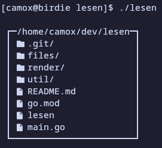

# lesen
a better ls



## usage
> [!IMPORTANT]
> you will need some sort of a nerd font installed in order for lesen to work properly 
run `lesen` in your terminal to list the contents of the current working directory

## installation
### you will need:
* go >=1.26.5

1. clone the repo
2. build with `go build`
3. if you want, symlink the binary to `/usr/local/bin` (or any other directory in your `PATH`)

## todo
- [x] current directory listing
- [x] pretty printing
- [x] colours n' stuff

```
```
